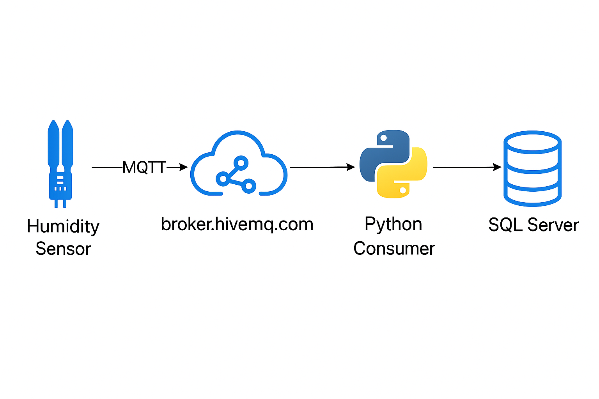

# FIAP - Faculdade de Informática e Administração Paulista

<p align="center">
  
</p>

# 🌾Projeto Enterprise Challenge - Sprint 4 - Reply🌾

---

## 👨‍🎓 Integrantes e Responsabilidades

| Integrante                                  | RM       | Papel (conciso)                 | Principais entregáveis (curto)                  |
|---------------------------------------------|----------|----------------------------------|-------------------------------------------------|
| **Daniele Antonieta Garisto Dias**          | RM565106 | **Dados/DER**                    | DER, `schema.sql`, consultas/índices           |
| **Leandro Augusto Jardim da Cunha**         | RM561395 | **MQTT/Ingestão**                | `ingest/consumer.py`, classe MQTT, logs        |
| **Luiz Eduardo da Silva**                   | RM561701 | **Integração/QA/Governança**     | roteiro de demo, critérios de aceite, revisão  |
| **João Victor Viana de Sousa**              | RM565136 | **Dashboard/KPIs**               | `dashboard/app.py`, KPIs e banner de alerta    |
| **Guilherme Ribeiro Slaviero**              | RM561757 | **ML/Métricas**                  | `ml/run_training.py`, matriz confusão, métricas |


---

## 👩‍🏫 Professores

### Tutor(a)
- <a>Leonardo Ruiz Orabona</a>

### Coordenador(a)
- <a>Andre Godoi Chiovato</a>

---

## 🎯 Introdução e Objetivo

A solução integra **sensoriamento (ESP32/simulação)**, **mensageria (MQTT)**, **persistência relacional (SQLite nesta demo)**, **ML básico** e **visualização/alertas** para apoiar decisões operacionais no contexto agroindustrial, com foco em **umidade do solo**.

**Objetivo Técnico-Operacional (aceite da banca):**
- **Pipelines executáveis e reprodutíveis**: coleta → ingestão → banco → ML → dashboard/alerta, seguindo a ordem de execução documentada.
- **Observabilidade mínima**: logs por etapa, prints e *health checks* simples do consumer.
- **Alerta mínimo operacional**: regra de *threshold* (faixas por cultura/sensor) acionando banner/log.
- **Métrica de ML**: relatório com `accuracy/balanced_accuracy` e matriz de confusão.
- **Curadoria de dados**: DER + *data dictionary* (atributos-chave, tipos e restrições).

**Script de Demonstração (3–5 min):**
1. `db/create_schema.py` + `db/load_seed.py` (DER e integridade).  
2. `ingest/consumer.py` + publicação de 5–10 mensagens (log de consumo).  
3. `SELECT` em `TBL_MONITORAMENTO` confirmando gravação.  
4. `ml/run_training.py` (métrica + artefatos).  
5. `streamlit run dashboard/app.py` (KPI + alerta forçado).

<p align="center">
  
</p>

### Regras de Negócio

- Leituras por **minuto** (parametrizável) via **MQTT** (*topic* ex.: `sensors/cafe/umidade`).  
- **Consumer** valida e persiste leituras em `TBL_MONITORAMENTO` (UTC ISO 8601).  
- **Thresholds** por cultura/sensor em `TBL_CULTURA_PRODUTO_SENSOR_CONFIGURACAO`.  
- **Estado atual** e **% conformidade** compõem o painel.

> **QA (aceite):** descarte de payload inválido com log; *drift* de timestamp < 2 min; idempotência (demo) por `cd_cultura_produto_sensor + dt_medicao`.

---

## 📝 Informações Relevantes e Dados Necessários

1. **Leitura por minuto do sensor de umidade (café)?** — **Sim.** Payload JSON padronizado; QoS 0; *keep-alive* 60s.  
   ```json
   {"timestamp":"2025-10-03T12:34:56Z","cultura":"cafe","sensor":"umidade_solo","valor":42.7,"unidade":"%"}
   ```
   <p align="center"></p>

2. **Persistência em `TBL_MONITORAMENTO`?** — **Sim.** Consumer faz parse/validação → resolve chaves → insere.  
   <p align="center"></p>
   <p align="center"></p>

3. **Faixas ideais por cultura/sensor?** — Em `TBL_CULTURA_PRODUTO_SENSOR_CONFIGURACAO`.  
   <p align="center"></p>
   ```sql
   SELECT c.nm_cultura, s.nm_sensor, cfg.vlr_minimo, cfg.vlr_maximo
   FROM TBL_CULTURA c
   JOIN TBL_CULTURA_PRODUTO_SENSOR cps ON c.cd_cultura = cps.cd_cultura
   JOIN TBL_CULTURA_PRODUTO_SENSOR_CONFIGURACAO cfg ON cps.cd_cultura_produto_sensor = cfg.cd_cultura_produto_sensor
   JOIN TBL_PRODUTO_SENSOR ps ON cps.cd_produto_sensor = ps.cd_produto_sensor
   JOIN TBL_SENSOR s ON ps.cd_sensor = s.cd_sensor
   WHERE cps.cd_cultura_produto_sensor = 1;
   ```

---

## 📊 Dashboard — Sensor de Umidade

- Série temporal (janela selecionável), **KPI de conformidade** e **estado atual**.  
- Alertas com timestamp e valor fora de faixa.
<p align="center"></p>

```sql
SELECT a.cd_cultura_produto_sensor, e.nm_cultura, c.nm_sensor
FROM TBL_CULTURA_PRODUTO_SENSOR a
INNER JOIN TBL_PRODUTO_SENSOR b ON a.cd_produto_sensor = b.cd_produto_sensor
INNER JOIN TBL_SENSOR c ON b.cd_sensor = c.cd_sensor
INNER JOIN TBL_CULTURA e ON e.cd_cultura = a.cd_cultura
WHERE a.cd_cultura_produto_sensor = 1;
```
<p align="center"></p>

---

## 🧱 Diagrama ER (Entidade-Relacionamento)

<p align="center"></p>
<p align="center"></p>

**Entidades (resumo):** `TBL_SENSOR`, `TBL_PRODUTO`, `TBL_CULTURA`, `TBL_PRODUTO_SENSOR`, `TBL_CULTURA_PRODUTO_SENSOR`, `TBL_CULTURA_PRODUTO_SENSOR_CONFIGURACAO`, `TBL_MONITORAMENTO`, `TBL_APLICACAO_MONITORAMENTO`.

**Índices (chaves de performance):**
```sql
CREATE INDEX TBL_MONITORAMENTO_IDX_VLR_MEDIDO ON TBL_MONITORAMENTO (vlr_medido);
CREATE INDEX TBL_MONITORAMENTO_IDX_DT_MEDICAO ON TBL_MONITORAMENTO (dt_medicao);
CREATE INDEX TBL_MONITORAMENTO_IDX_MEDIDO_DATA ON TBL_MONITORAMENTO (vlr_medido, dt_medicao);
CREATE INDEX TBL_MONITORAMENTO_IDX_CPS_DATA ON TBL_MONITORAMENTO (cd_cultura_produto_sensor, dt_medicao);
```

---

## 🌱 Machine Learning Básico

**Classificação:** `Abaixo do mínimo` | `Entre min e max` | `Acima do máximo`.  
**Algoritmo:** `RandomForestClassifier(n_estimators=100, random_state=42)`  
**Baseline:** regra de thresholds (comparativo).  
**Entradas:** janelas temporais (médias/STD/Δ), *one-hot* de cultura/sensor (quando aplicável).  
**Métricas:** `accuracy`/`balanced_accuracy` + matriz de confusão.  
**Procedimento:** *split* estratificado; CV k=3; artefatos `joblib` e gráficos em `/docs/evidencias`.
<p align="center"></p>

---

## 💼 Proposta de Valor (Impacto & Diferenciais)

**Resumo Executivo:** Transformamos dados de sensores em **decisão acionável** em minutos, com arquitetura **end‑to‑end**, **reprodutível** e **observável**, pronta para escalar com segurança e baixo TCO.

**Diferenciais Únicos (8 pontos):**
1) **E2E real**: do sensor ao insight (pipeline executável).  
2) **Reprodutibilidade auditável**: seeds, scripts, ordem de execução.  
3) **Observabilidade desde o início**: logs por etapa, KPIs (conformidade/MTTA).  
4) **Modelo de dados robusto**: chaves, *checks* e índices prontos para produção.  
5) **Segurança & MLOps-ready**: TLS/autenticação, MLflow, CI/CD e *model registry*.  
6) **TCO baixo**: stack leve (Python + SQLite/Streamlit) com *upgrade* para PostgreSQL/nuvem.  
7) **Extensível**: inclusão rápida de novos sensores (pH, temperatura, condutividade).  
8) **Valor mensurável**: metas operacionais e financeiras claras.

**Resultados Alvo (mensuráveis):**
- **≥ 10%** redução de intervenções sem necessidade.  
- **≥ 80%** leituras na faixa ideal por cultura/sensor.  
- **≤ 60s** MTTA na demo (detecção → alerta).

**Roadmap de Adoção (oferta):** PoC (4–6 sem.) → Piloto (8–12 sem.) → Escala (12+ sem.); ver detalhes no repositório.

---

## 🚀 Extensões & Roadmap de Evolução (Avançado)

**Escalabilidade & Dados**
- Migrar `SQLite → PostgreSQL` com **particionamento por data** e **retention policy**.  
- **CDC/ELT** para *data warehouse* (ex.: BigQuery/Redshift) e camadas analíticas.  
- **Catálogo de Dados**: *data dictionary* versionado + *data contracts* (OpenAPI/JSON Schema) para o payload MQTT.

**MLOps & Qualidade de Modelo**
- **MLflow** para *experiments*, *model registry* e promoção de versões.  
- **Monitoramento de Drift** (entrada/saída): *population stability index*, KS-test.  
- **Feature Store** (Feast): reuso/consistência treino‑produção.

**Observabilidade & Confiabilidade**
- **Prometheus/Grafana**: latência, throughput, erros; *Alertmanager* básico.  
- **Retry/Dead‑letter** no consumer; dashboards de saúde do pipeline.  
- **SRE-lite**: *error budget* e *blameless postmortems* (acadêmico).

**Segurança & Compliance**
- **TLS + autenticação** no broker MQTT; **rotação de credenciais** e *secrets management*.  
- **Logging sanitizado** (sem PII); *backup/restore* e trilha de auditoria.

**Integrações & Produto**
- Notificações via e-mail/SMS/Teams; webhooks; integração com **ERP/SCADA**.  
- **Camada de regras** (no/low-code) para que o agrônomo ajuste faixas/ações sem depender de TI.  
- **Aplicação móvel** (v2) com *push notifications* e modo offline.

**KPIs de Evolução**
- Custo por hectare monitorado; tempo de onboarding de nova cultura/sensor; redução de *false alarms*.

---

## ✅ Fechamento 

- **PoC pronto para campo**: 2–3 sensores reais, PostgreSQL gerenciado, alertas e-mail/SMS, painel operacional com KPIs.  
- **Runbook & Playbook**: guia de operação e expansão para piloto, com tarefas, riscos e checkpoints.  
- **Contrato de Sucesso**: metas pactuadas (≥10% menos intervenções; ≥80% leituras na faixa; MTTA ≤ 60s).  
- **Próxima reunião**: alinhamento técnico‑operacional e *kickoff* de PoC em até 1 semana letiva.

> Temos um MVP **executável, reproduzível e mensurável**. É um passo sólido para gerar **valor operacional real** com **baixo custo de entrada** e **rota clara de escala**. 
---

## 🔗 Links
- **Vídeo (YouTube – não listado):** https://www.youtube.com/watch?v=qogCAJ_vV08  
- **Repositório:** https://github.com/SKamacorde/Sprint_4

---
