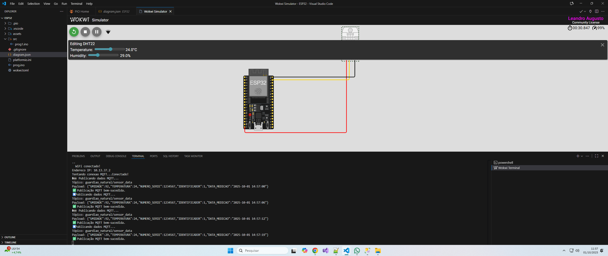
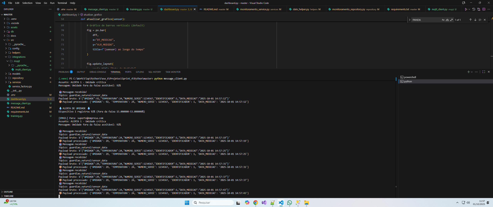
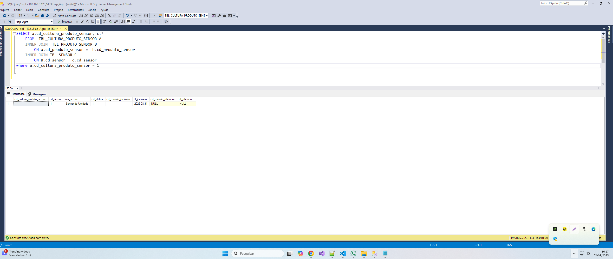
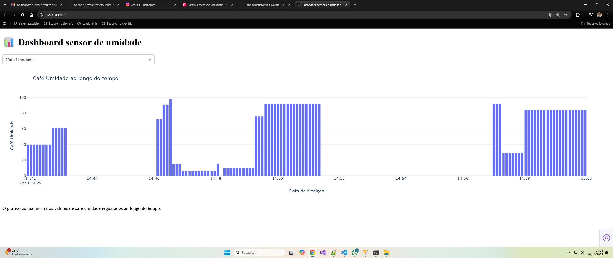
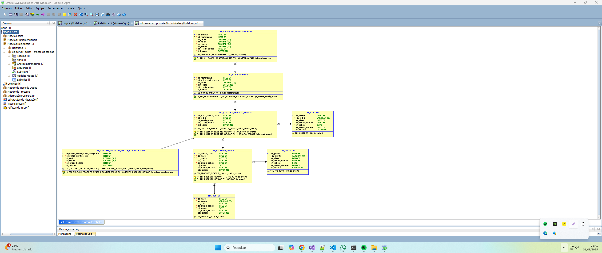
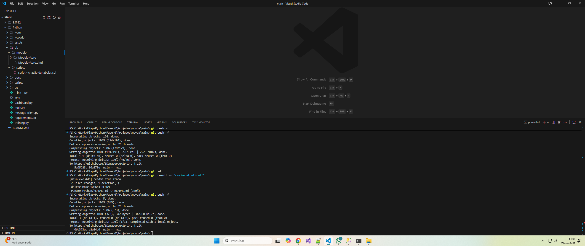
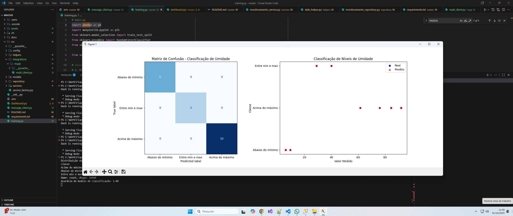

# FIAP - Faculdade de Informática e Administração Paulista

<p align="center">
  
</p>

# 🌾Projeto Enterprise Challenge - Sprint 4 - Reply🌾

---

## 👨‍🎓 Integrantes e Responsabilidades:

| Nome Completo                   | RM       |
| ------------------------------- | -------- |
| Daniele Antonieta Garisto Dias  | RM565106 |
| Leandro Augusto Jardim da Cunha | RM561395 |
| Luiz Eduardo da Silva           | RM561701 |
| João Victor Viana de Sousa      | RM565136 |
| Guilherme Ribeiro Slaviero      | RM561757 |

---

## 👩‍🏫 Professores:

### Tutor(a)

-   <a>Leonardo Ruiz Orabona</a>

### Coordenador(a)

-   <a>Andre Godoi Chiovato</a>

---

## 🎯 Introdução e Objetivo

A solução proposta utiliza sensores para monitoramento em tempo real de variáveis do solo, como umidade. Os dados são coleatados, processados e armazenados para subsidiar decisões técnicas, como a aplicação de insumos agrícolas, além de possibilitar análises históricas e preditivas, otimizando os recursos e promovendo maior eficiência no cultivo.

### Regras de Negócio

-   Os sensores realizam leituras a cada minuto e enviam os dados por meio do protocolo MQTT.
-   Um consumidor (consumer) recebe as mensagens e armazena os valores medidos na tabela `TBL_MONITORAMENTO`.
-   O sistema compara essas leituras com os valores mínimo e máximo definidos na tabela `TBL_CULTURA_PRODUTO_SENSOR_CONFIGURACAO` para envio de alertas.

## 📝 Informações Relevantes e Dados Necessários

O sistema deve responder a perguntas como:

1. **Sensor de umidade para a cultura cafe realiza a leitura a cada minuto**
-   Os sensores realizam leituras a cada minuto e enviam os dados por meio do protocolo MQTT.
<p align="center">
  
</p>

2. **Sensores registram leituras a cada minuto, armazenadas em TBL_MONITORAMENTO**
    - Um consumidor (consumer) recebe as mensagens e armazena os valores medidos na tabela `TBL_MONITORAMENTO`
      <p align="center">
        
      </p>
    - Classe responsável por configurar e gerenciar a comunicação com a mensageira MQTT, incluindo a conexão com o broker, assinatura de tópicos e publicação/recebimento de mensagens.
      <p align="center">
        
      </p>

3. **Quais são os valores ideais para cada cultura monitorada?**
    - O sistema compara essas leituras com os valores mínimo e máximo definidos na tabela `TBL_CULTURA_PRODUTO_SENSOR_CONFIGURACAO` para envio de alertas.
        <p align="center">
          
        </p>
    - Dados: Faixas mínimas/máximas por sensor e cultura (`TBL_CULTURA_PRODUTO_SENSOR_CONFIGURACAO`).
    - Exemplo de consulta:

        ```sql
        SELECT c.nm_cultura, s.nm_sensor, cfg.vlr_minimo, cfg.vlr_maximo
        FROM TBL_CULTURA c
        JOIN TBL_CULTURA_PRODUTO_SENSOR cps ON c.cd_cultura = cps.cd_cultura
        JOIN TBL_CULTURA_PRODUTO_SENSOR_CONFIGURACAO cfg ON cps.cd_cultura_produto_sensor = cfg.cd_cultura_produto_sensor
        JOIN TBL_PRODUTO_SENSOR ps ON cps.cd_produto_sensor = ps.cd_produto_sensor
        JOIN TBL_SENSOR s ON ps.cd_sensor = s.cd_sensor
        WHERE cps.cd_cultura_produto_sensor = 1;
        ```   

## Dashboard Sensor de Umidade

-   Buscar os registro do sensor de umidade para a cultura cafe\*\*
    <p align="center">   
      
    </p>
    - Exemplo de consulta:
        ```sql
        SELECT a.cd_cultura_produto_sensor,e.nm_cultura ,  c.nm_sensor
        FROM  TBL_CULTURA_PRODUTO_SENSOR A
        INNER JOIN  TBL_PRODUTO_SENSOR B
        ON a.cd_produto_sensor =  b.cd_produto_sensor
        INNER JOIN TBL_SENSOR C
        ON B.cd_sensor = c.cd_sensor
        INNER JOIN TBL_CULTURA E
        ON E.cd_cultura = a.cd_cultura
        WHERE a.cd_cultura_produto_sensor = 1
    - Responsável por exibir os gráficos com os valores medidos pelos sensores, permitindo a visualização e análise dos dados em tempo real ou histórico 
    <p align="center">
      
    </p>

## 🧱 Diagrama ER (Entidade-Relacionamento) com entidades, atributos, relacionamentos, cardinalidades e chaves primárias/estrangeiras;

Imagem do Diagrama ER exportado.

<p align="center">
  
</p>

Arquivos do projeto de modelagem de banco de dados (.dmd, .sql ou outro formato)

<p align="center">
  
</p>
### Entidades e Atributos

1. **TBL_SENSOR**

    - `cd_sensor` – NUMBER – Chave primária
    - `nm_sensor` – VARCHAR(50) – Nome do sensor (e.g., 'pH', 'Umidade')
    - `cd_status` – NUMBER(1) – Status (0 = inativo, 1 = ativo)
    - `cd_usuario_inclusao` – NUMBER – Usuário que criou o registro
    - `dt_inclusao` – DATE – Data de criação
    - Constraints: `cd_status CHECK (cd_status IN (0, 1))`, `nm_sensor NOT NULL`

2. **TBL_PRODUTO**

    - `cd_produto` – NUMBER – Chave primária
    - `nm_produto` – VARCHAR(50) – Nome do produto (e.g., 'Água', 'Fertilizante NPK')
    - `cd_usuario_inclusao`, `dt_inclusao` – Dados administrativos
    - Constraints: `nm_produto NOT NULL`

3. **TBL_CULTURA**

    - `cd_cultura` – NUMBER – Chave primária
    - `nm_cultura` – VARCHAR(50) – Nome da cultura (e.g., 'Soja', 'Milho')
    - `cd_usuario_inclusao`, `dt_inclusao` – Dados administrativos
    - Constraints: `nm_cultura NOT NULL`

4. **TBL_PRODUTO_SENSOR**

    - `cd_produto_sensor` – NUMBER – Chave primária
    - `cd_sensor` – NUMBER – FK para `TBL_SENSOR`
    - `cd_produto` – NUMBER – FK para `TBL_PRODUTO`

5. **TBL_CULTURA_PRODUTO_SENSOR**

    - `cd_cultura_produto_sensor` – NUMBER – Chave primária
    - `cd_cultura` – NUMBER – FK para `TBL_CULTURA`
    - `cd_produto_sensor` – NUMBER – FK para `TBL_PRODUTO_SENSOR`

6. **TBL_CULTURA_PRODUTO_SENSOR_CONFIGURACAO**

    - `cd_cultura_produto_sensor_configuracao` – NUMBER – Chave primária
    - `cd_cultura_produto_sensor` – NUMBER – FK
    - `vlr_minimo`, `vlr_maximo` – NUMBER(10,6) – Limites para a cultura
    - Constraints: `vlr_minimo <= vlr_maximo`

7. **TBL_MONITORAMENTO**

    - `cd_monitoramento` – NUMBER – Chave primária
    - `cd_cultura_produto_sensor` – NUMBER – FK
    - `vlr_medido` – NUMBER(10,6) – Valor lido pelo sensor
    - `dt_medicao` – DATE – Data/hora da aplicação
    - `dt_inclusao` – DATE – Data/hora da leitura
    - Constraints: `vlr_medido NOT NULL`

8. **TBL_APLICACAO_MONITORAMENTO**
    - `cd_aplicacao` – NUMBER – Chave primária
    - `cd_monitoramento` – NUMBER – FK
    - `vlr_medido`, `vlr_minimo`, `vlr_maximo`, `vlr_aplicado` – NUMBER(10,6)
    - `dt_inclusao` – DATE – Data/hora da aplicação

### Índices

-   `CREATE INDEX TBL_MONITORAMENTO_IDX_VLR_MEDIDO ON TBL_MONITORAMENTO (vlr_medido);`
-   `CREATE INDEX TBL_MONITORAMENTO_IDX_DT_MEDICAO ON TBL_MONITORAMENTO (dt_medicao);`
-   `CREATE INDEX TBL_MONITORAMENTO_IDX_MEDIDO_DATA ON TBL_MONITORAMENTO (vlr_medido, dt_medicao);`

### Relacionamentos e Cardinalidade

-   **1:N** entre `TBL_PRODUTO` e `TBL_PRODUTO_SENSOR`.
-   **1:N** entre `TBL_SENSOR` e `TBL_PRODUTO_SENSOR`.
-   **1:N** entre `TBL_CULTURA` e `TBL_CULTURA_PRODUTO_SENSOR`.
-   **1:N** entre `TBL_PRODUTO_SENSOR` e `TBL_CULTURA_PRODUTO_SENSOR`.
-   **1:N** entre `TBL_CULTURA_PRODUTO_SENSOR` e `TBL_MONITORAMENTO`.
-   **1:N** entre `TBL_MONITORAMENTO` e `TBL_APLICACAO_MONITORAMENTO`.

## 🌱 Machine Learning Básico

1️⃣ Classificação ✅

-   Categorizar os valores medidos da umidade em classes discretas (`Abaixo do mínimo", Entre min e max, Acima do máximo`) utilizando Random Forest Classifier.
-   RandomForestClassifier → cria um classificador baseado em Random Forest, que é um conjunto de árvores de decisão.
-   n_estimators=100 → o modelo vai criar 100 árvores; mais árvores geralmente melhoram a estabilidade, mas aumentam o tempo de treinamento.
-   random_state=42 → garante reprodutibilidade; sempre que rodar com a mesma seed, os resultados serão iguais
<p align="center">
  
</p>

## 🌱 Possíveis Extensões

-   **Modelos Preditivos Simples**: Com os dados históricos registrados em `TBL_MONITORAMENTO`, é possível aplicar regressões lineares ou modelos de séries temporais simples (como média móvel ou suavização exponencial) para estimar variações futuras de umidade ou pH, contribuindo, por conseguinte, uma irrigação mais eficiente.

-   **Dashboards Operacionais**: Usando ferramentas como Power BI, Metabase ou até planilhas conectadas ao banco, é possível gerar painéis visuais com gráficos de tendência por cultura, tipo de sensor, faixas críticas de medição, entre outros indicadores operacionais.

## 🔗 Links
Link Video YouTube:
(https://www.youtube.com/watch?v=qogCAJ_vV08)
Link Repositorio:
(https://github.com/SKamacorde/Sprint_4)
